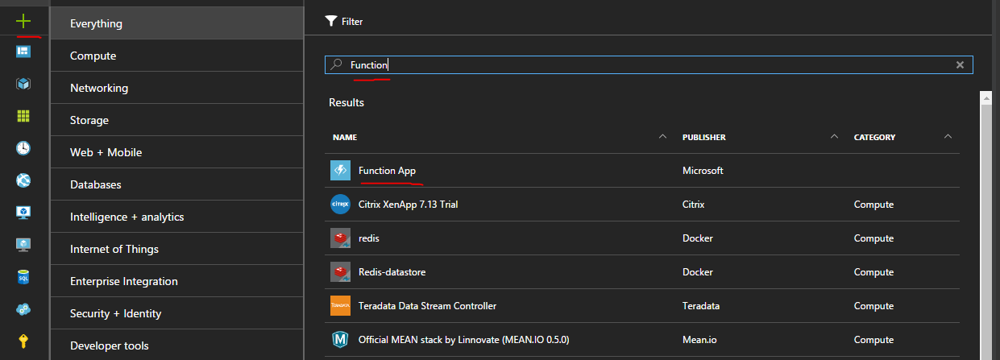
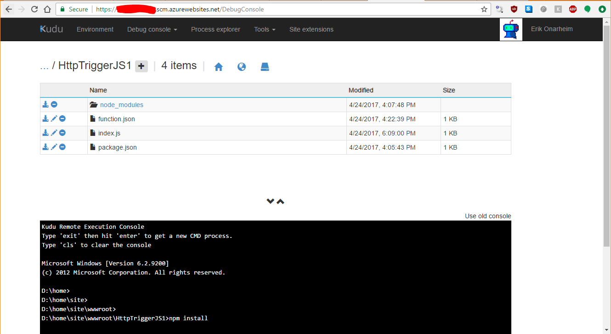
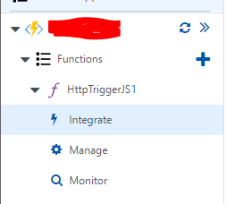
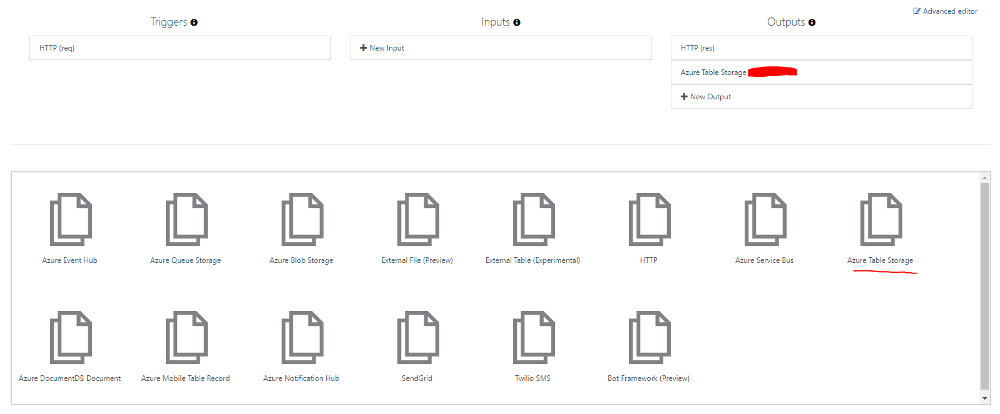
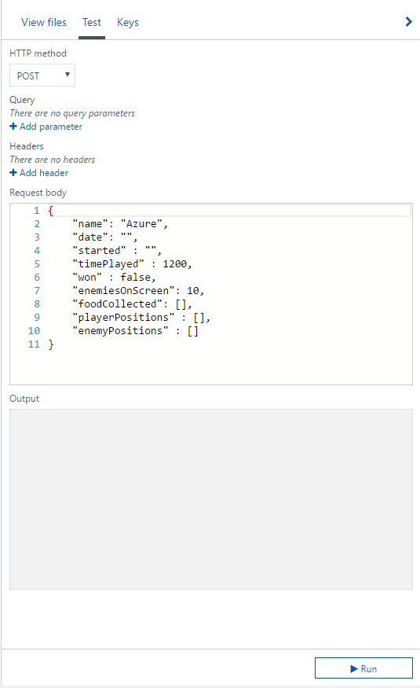
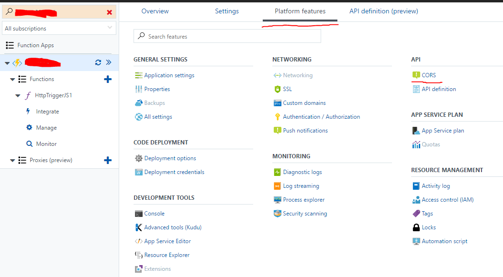

Title: Building Custom Analytics with Azure Functions
Published: 4/27/2017
Tags: 
 - Azure
 - Azure Functions
 - Azure Table Storage
 - Ludum Dare
 - Games
disqus_identifier: https://erikonarheim.com/posts/custom-analytics-azure-functions/
---

Recently we did a [game jam](https://excaliburjs.com/ludum-38/) for Ludum Dare 38, and we were not satisfied with the level of customization in analytics providers out there, so we decided to build our own with [Azure Functions](https://docs.microsoft.com/en-us/azure/azure-functions/functions-create-first-azure-function) with [Azure Table Storage](https://docs.microsoft.com/en-us/azure/storage/storage-dotnet-how-to-use-tables) as a semi-unstructured data store. We were up and running quickly and the process was fairly easy. 

## Setting up the function

For pennies on the dollar, you can setup Azure functions easily on in an azure account (currently forcasted to spend ~20 cents this billing period!). All that's required is an existing Azure account, which can be created [here](https://portal.azure.com).

Next navigate to the new plus icon in the top left of your screen, search for function, and click the item labeled **Function App** published by Microsoft. After clickig create you'll have a few options. You'll notice that azure fuctions live inside of the `*.azurewebsites.net` subdomain, this is because technically they live in the Azure web apps ecosystem.



You'll need to pick a name, location (I recommend a place near-ish where people will be calling the function), hosting plan, and a storage account. 


## Writing a function

In this example I'm using the Node.js support in Azure functions to write a function. It is pretty easy to test and setup output to Azure table storage. It can even be wired up with source control so that code checked into github or another source code hosting provider is automatically deployed (Under **Platform Features** -> **Deployment Options**).

```javascript
var uuid = require('node-uuid');

module.exports = function (context, req) {
    context.log('JavaScript HTTP trigger function processed a request.');

    if (req.body && req.body.started) {

        // Add the required properties for Azure Table Storage
        var payload = {
            // Records in a single partition are fast to retrieve together, since I don't really have many records I used this scheme to force a convenient sorting in Storage Explorer, probably not ideal for a production scenario.
            PartitionKey: (Number.MAX_SAFE_INTEGER - Date.now()).toString(),
            // RowKey is the unique identifier in a partition, using GUIDs to solve this.
            RowKey: uuid.v4()
        }

        // Since table storage is NoSQL-ish you can drop whatever columns you want into it dynamically
        for(var prop in req.body){
            // exclude private _ members
            if(prop[0] !== '_'){
                payload[prop] = JSON.stringify(req.body[prop])
            }
        }

        // These bindings need to be added to the contex and are magically added 
        context.bindings.ludum38data = []
        context.bindings.ludum38data.push(payload);
        
        // Return value to echo back data stored
        context.res = {
            // Store analytics payload in table storage
            
            body: "Stored analytics: " + JSON.stringify(payload, null, 3)
        };
    }
    else {
        context.res = {
            status: 400,
            body: "Please pass a valid analytics body"
        };
    }
    context.done();
};
```

The one **hiccup** is that in order to use node modules like `node-uuid` you need to navigate to your functions scm (Kudu) site, create a `package.json` file, and run `npm install` manually. This can be found in the function's **Platform features** tab labeled **Advanced tools (Kudu)** or if you go to `<nameofyourapp>.scm.azurewebsiets.net`. Navigate to the directory containging the `package.json` and run `npm install`

```json
{
  "name": "ludum38stats",
  "dependencies" : {
      "node-uuid": "~1.4.8"
  }
}
```




## Integrating with Azure Table Storage

Remember that storage account we created when we set up the Azure function? We'll use that to store our semi-unstructured data from analytics.

In the **Integrate** section of your specific function you can attack different data outputs to your function. In this case we want to persist it to Azure table storge.



Once we select the **Azure Table Storage** preset in the 'New Output' wizard, it is pretty easy to add things to it.




In your function you'll need to reference the `outputTable` that you've created in order to store things. Unfortunately it is a little unintuitive but you'll need to create your own array off of the `Azure function context` to submit your values.

So this would be an example of using the table parameter name above:

```javascript

var payload = {
    PartitionKey: (Number.MAX_SAFE_INTEGER - Date.now()).toString(),
    RowKey: uuid.v4()
}
...
context.bindings.outputTable = []
context.bindings.outputTable.push(payload);

```

In order to insert into Azure table storage there are 2 required properites `PartitionKey` and `RowKey`. `PartitionKey` allows you to partition data to enhance data clustering, things with the same `PartitionKey` can be queried more quickly. `RowKey` is meant to be the unique itentifier for a row witin a partition. The rest of the properties are up to you, there are some limitations to be aware of, but they are pretty generous.

To test if things are working, Azure has a convenient test window to send fiddler like requests to your function.



Once you've pushed data into Azure Table Storage there is a convenient cross platform client from Microsoft to view the data located at http://storageexplorer.com/


## CORS (Cross-Origin Resource Sharing) in Azure Functions

This setting is a pretty well hidden, but if you click on the **Platform Features** tab inside of the Azure function you'll find `CORS` under the `API` heading. Enter your domains to whitelist, **IF YOU WANT TO ALLOW ALL** you'll need to delete all entries and put a `*`, this does mean that **ANYONE IN THE WORLD** can call your function from any web page. Generally speaking this is a bad idea, but for our game analytics for LD38 it doesn't really matter.




With CORs implemented all we needed to do on to build our custom client-side logger was the following. `Config.analyticsEndpoint` is just the obscured function url that can be accessed in Azure with a click of the **Get function URL** button.

```typescript
interface IPosition {
   x: number,
   y: number
}

interface IPayload {
   date: string, // date
   commit: string,
   seed: number, // seeded value
   started: number, // time
   timePlayed: number, // amount of time played
   won: boolean, // won or lost
   enemiesOnScreen: number, 
   foodCollected: string[],
   playerPositions: IPosition[]
   enemyPositions: IPosition[],
}

class Analytics {


   public static publish(payload: IPayload){
      return fetch(Config.analyticsEndpoint, {
         method: 'POST',
         headers: {
            'Content-Type': 'application/json'
         },
         body: JSON.stringify(payload)
      });
   }   
   
}
```


## Putting it all together

Once that was complete we were able to build a heat map for player analytics for our game to see where people go in order to help better design the game.

Check out the cool heat map with our custom data (pun intended) 😎


