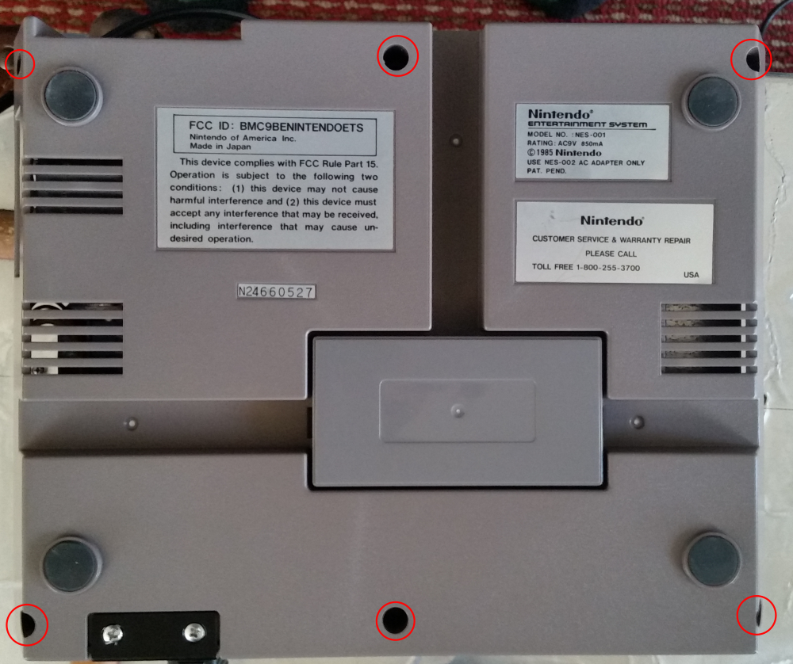
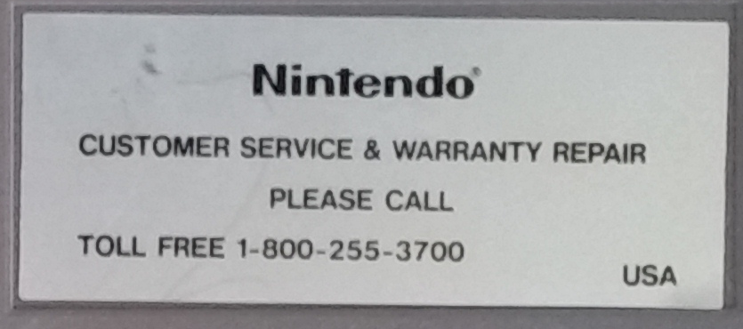
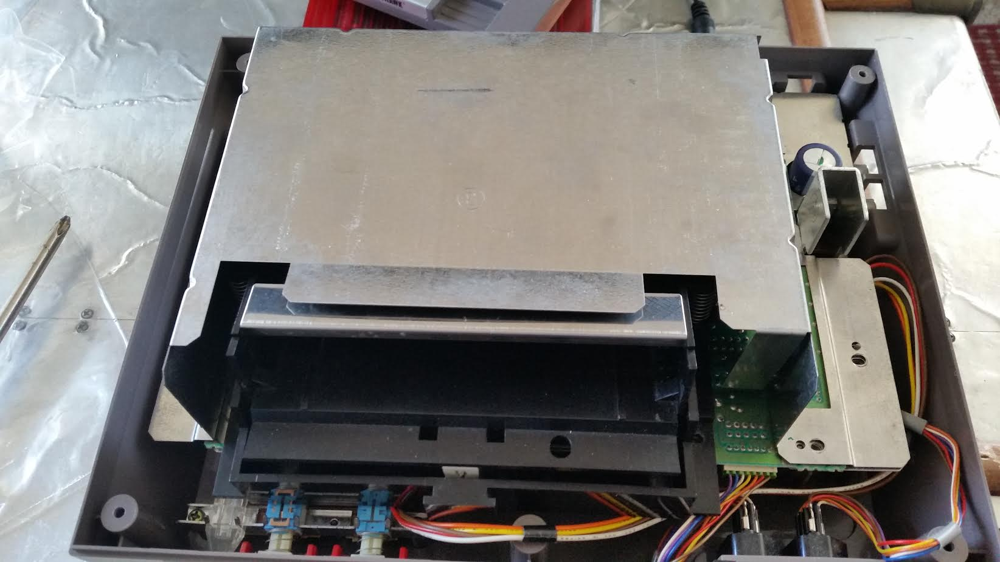
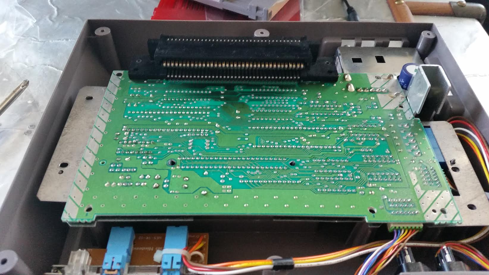
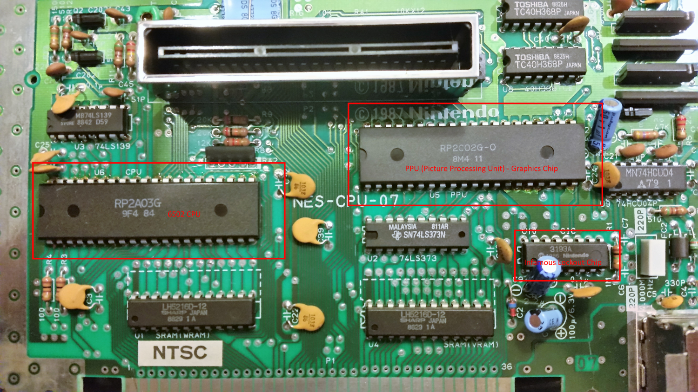
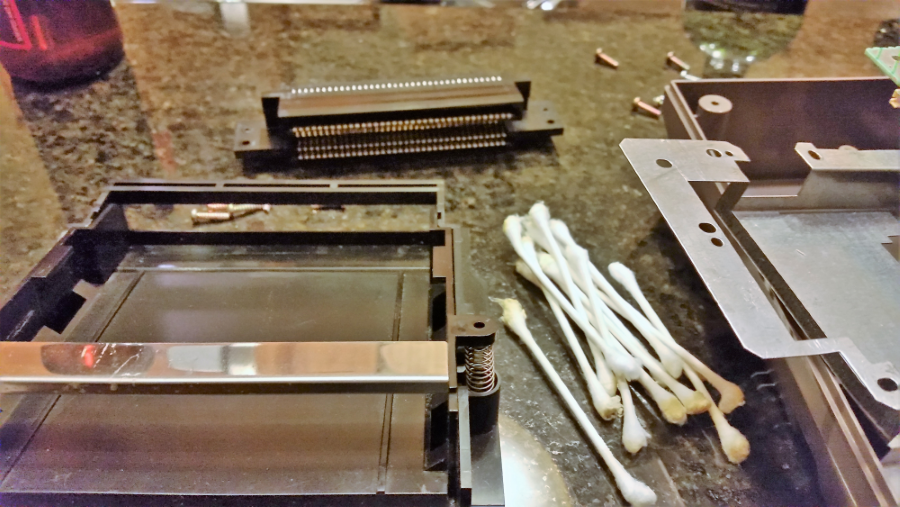
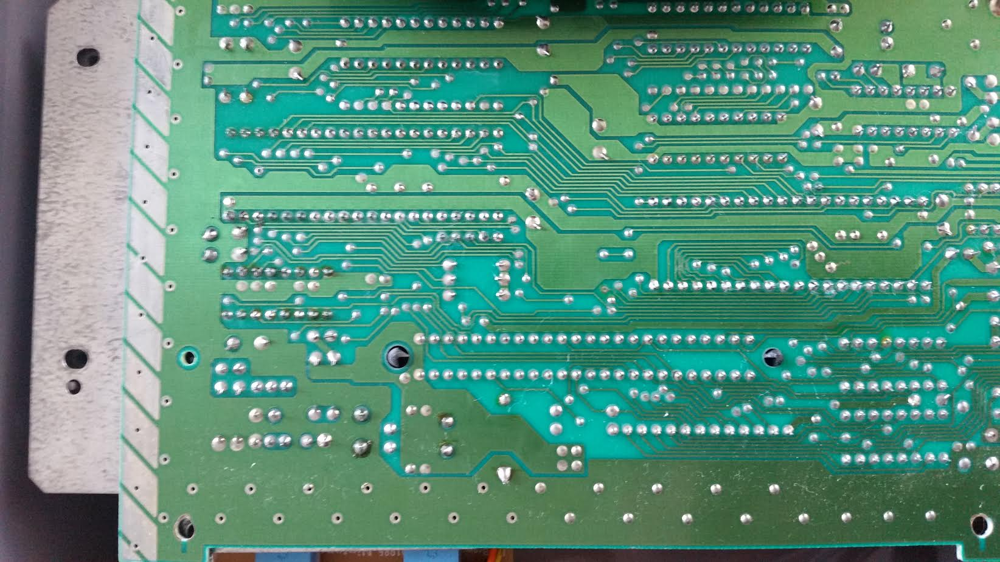
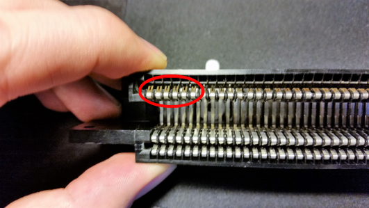
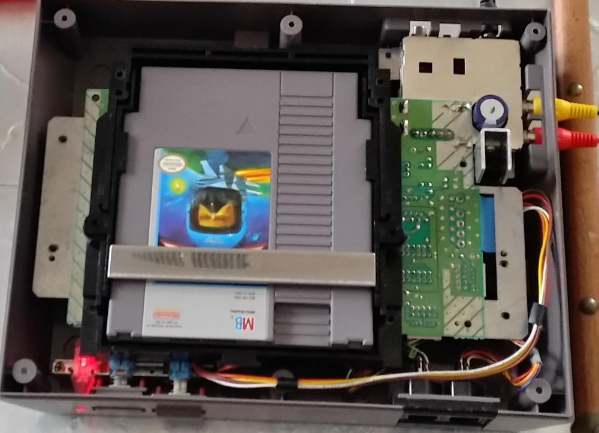

Title: Restoring an old broken NES
Published: 2/26/2017
Tags: 
 - Hardware
 - NES
 - Games
disqus_identifier: https://erikonarheim.com/posts/restoring-old-nes/
---

I recently acquired an original Nintendo Entertainment System for an upcoming talk where I show how to develop real NES games in 6502. There was only one problem, the NES was not working and flashing the infamous "Red Blink of Death." In this post I'll walk through the steps I used to restore and repair my NES.

### Spelunking inside the NES

First I wanted to see what was wrong, so I opened up the NES for visual inspection to check for any obvious problems. The original NES is surprisingly easy to take apart with a standard Philips head screwdriver (compared to later Nintendo devices with bizarre screws that no one has the wrench for). There are only 6 screws to undo and the top of the Nintendo will come right off.

I wonder if they'll still help me... 😉

Looking inside you'll see the RF shielding which is fairly easy to remove, it's just held on with a couple screws.

I just went through all the other parts and unscrewed everything. Once I did that, you can pull the loader mechanism off fairly easy. The loader mount has the only special long screws in the NES, the rest are interchangeable, remember where they go.

The top side of the PCB board looks pretty good, there is some slight visible corrosion on some of the PPU and CPU pins. For the most part the traces look okay on this side, no burns, no dead capacitors, etc.

The bottom of the PCB (which faces towards to top of the console when it's mounted) is a different story. It looks like there was some sort of liquid spilled into the console, possibly soda, or juice. It looks like it also caused some corrosion as well.

After this discovery, I spent around an hour our so with isopropyl alcohol ~90% (don't worry it's perfectly safe for electronics) and some Q-tips cleaning up the sticky residue on the bottom of the PCB. I went through a lot of Q-tips to get this clean. One downside of this is that the Q-tips began to leave cotton fuzz everywhere that I needed to pull off later, I don't think cotton on the PCB is good for the NES 😉

While I was at it I also cleaned up the PCB 72-pin connector contact as well 

TA-DA! A much cleaner PCB, you'll want to let this dry for a bit. (Photo was taken the next day, marked improvement from before)

But after all that cleaning, things still didn't work 😭

### Enter the 72-pin connector

Another common thing that can wear out over time is the 72-pin connector that connects the game cartridge to the NES PCB, so I decided to see if I couldn't clean/repair that. There are a lot of people that have had success fixing the "Red Blink of Death" buy cleaning the contacts of corrosion either by rubbing the pins with a cleaner like isopropyl alcohol, or by using the [boiling method](https://www.youtube.com/watch?v=HrrRSAr1rVs). However, I didn't have a cooking pot I wanted to sacrifice to mad science, so I went with the [pin bending](https://www.youtube.com/watch?v=1AHJGJhCLs8) method instead. (I prefer my food not taste like 35 year old electronics! Ack!)

I cleaned the connections as best I could with rubbing alcohol but that had no effect. There is some definite corrosion on the pins highlighted that doesn't show up in the photo. It is difficult to clean this small space, and if I had a science pot I'd be boiling it for 30 minutes.

Let the bending of the pins commence! I used a safety pin and an overhead desk lamp to bend the pins up slightly, this will have the side effect of making the cartridge harder to insert into the mechanism but hopefully that means better contact.

Here you can see the first 6 pins bent upwards, I proceeded to bend the rest of the pins and remounted everything in the NES.

At this point I had assembled and disassembled the NES like 6 times, so I just put things together without screws to see if things worked... and booyah!

### Wrapping it up

After all this work, the NES still has about a 50% success rate of booting the cartridge, which is much better than the 0% success rate before I started. You can make this better doing the wiggle trick. While the cart is loaded in the NES wiggle the top of it and repeatedly hit reset until the) game boots. I suspect even with the bent pins on the 72-pin connector the corrosion is significant enough to prevent good contact. 

Since I don't want to try boiling electronics in my cookware, I purchased a [replacement 72-pin connector on Amazon](https://www.amazon.com/gp/product/B00EUT0BQU) for $10 which I thought was reasonable. Hopefully, this will increase the success rate to 100% of the time it works 100% of the time 😎 I'll post an update to this as soon as I recieve the part.

-Erik