Title: Migrating to Wyam in GH Pages from WordPress
Published: 2/17/2017
Tags: 
 - Static Site
 - Wyam
 - Markdown
 - Razor
 - WordPress
 - GitHub Pages
disqus_identifier: https://erikonarheim.com/posts/using-wyam-blog/
---
Recently I needed to update my blog WordPress version (yet again), along with patch my server, update my HTTPS certificate, and pay my hosting bill. The amount of admin-istrivia around maintaining your own server and application platform is more than I want to do for a blog going forward. This got me thinking there must be a better way to do this. My friends, [@kamranayub](https://twitter.com/kamranayub) in particular, have been pushing me to do more blogging and to move to static site generation. So here goes!

(BTW, this setup is saving me $400 per year on hosting costs!)

## Intro Wyam

This leads me to the Wyam static site generator. It is a great little static site generator built in C#/.NET (full framework). If you come from a Markdown/Razor background you'll really find this stuff really familiar and easy to use. Wyam is super configurable, fully customizable, and compatible with GitHub pages. Let's dig into it!


## Installing Wyam

Installing Wyam is pretty easy, navigate [here](https://wyam.io/docs/usage/obtaining) and follow one of the many ways to install. I used the Windows installer, unfortunately it does not automatically add itself to the path. Fortunately, it is easy to do with the following command once installed:

```powershell
%LocalAppData%\Wyam\Wyam.Windows add-path
```

In a new command window you can confirm wyam is in your patch:

```powershell
wyam --help
```


## Building your blog in Wyam


Check out the [blog recipe](https://wyam.io/recipes/blog/overview) on wyam's site, but honestly it is as easy as running:

```cmd
mkdir blog
cd blog
wyam new -r Blog
```

`wyam new -r Blog` will generate the blog scaffolding in the current directory.

To build your static html files into the `output/` directory, run `wyam -r Blog -t CleanBlog`. This will build the Blog recipe with the CleanBlog theme. You may also just encode these parameters in your `config.wyam` created at the root then you only need to run `wyam` in the directory with the config file.

```cmd
#recipe Blog
#n Wyam.Markdown
#t CleanBlog
Settings[BlogKeys.Title] = "Erik Onarheim";

```


Top level files in your input directory will show up in your nav bar, notice that they can be a mix of cshtml or markdown! So really some pages that need some more power can use Razor, others just Markdown.

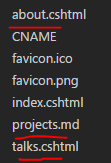


Building a new blog post is as simple as dropping a new markdown file in your input/posts directory and adding the appropriate metadata to the file.

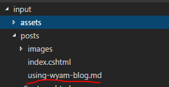

```markdown

Title: Migrating to Wyam in GH Pages from WordPress
Published: 2/17/2017
Tags: 
 - Static Site
 - Wyam
 - Markdown
 - Razor
 - WordPress
 - GitHub Pages
disqus_identifier: https://erikonarheim.com/posts/using-wyam-blog/
---
Recently I needed to update my blog WordPress version (yet again)...

```

The default theme is pretty slick, **but if you ever want to tweak it**, it is as easy as dropping a new file with the same name as the theme. Below I've added a custom `_Layout.cshtml`, `_Footer.cshtml`, and more that I copied from [Wyam's CleanBlog github](https://github.com/Wyamio/Wyam/tree/develop/themes/Blog/CleanBlog) and tweaked with my own google analytics and favicon. You'll also notice that you can mix and match Markdown with you Razor cshtml!

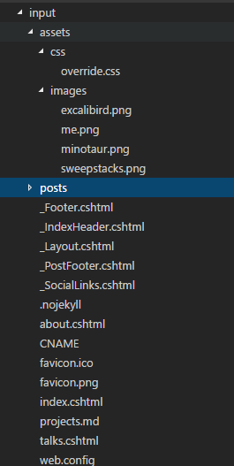

### Customizing Wyam with Disqus

Wyam comes with a bunch of built-in [document metadata](https://wyam.io/recipes/blog/document-metadata) which can be used to give the post a title, tags, published date. Custom metadata is also supported as well! Notice the `disqus_identifier` metadata which I use to add comments into my posts. This particular tag is picked up by my  custom `_PostFooter.cshtml` here, note the `@Model.String("disqus_identifier")` the rest comes from disqus's embedding documentation.

```html

<div id="disqus_thread"></div>

<script type="text/javascript">
    var disqus_shortname = 'erik-onarheim';
    var disqus_identifier = '@(Model.String("disqus_identifier") ?? Model.FilePath(Keys.RelativeFilePath).FileNameWithoutExtension.FullPath)';
    var disqus_title = '@Model.String(BlogKeys.Title)';
    var disqus_url = '@Context.GetLink(Model, true)';

    /* * * DON'T EDIT BELOW THIS LINE * * */
    (function() {
        var dsq = document.createElement('script'); dsq.type = 'text/javascript'; dsq.async = true;
        dsq.src = '//' + disqus_shortname + '.disqus.com/embed.js';
        (document.getElementsByTagName('head')[0] || document.getElementsByTagName('body')[0]).appendChild(dsq);
    })();
    
    (function () {
        var s = document.createElement('script'); s.async = true;
        s.type = 'text/javascript';
        s.src = '//' + disqus_shortname + '.disqus.com/count.js';
        (document.getElementsByTagName('HEAD')[0] || document.getElementsByTagName('BODY')[0]).appendChild(s);
    }());
</script>
<noscript>Please enable JavaScript to view the <a href="http://disqus.com/?ref_noscript">comments powered by Disqus.</a></noscript>
<a href="http://disqus.com" class="dsq-brlink">comments powered by <span class="logo-disqus">Disqus</span></a>

```

It's pretty much that easy to make changes to the default template to make your own customizations! 

## Testing Wyam locally with IIS (or just use the easy way)

When I started working on this I tried a number of different of local servers to test this, TLDR: just use `wyam preview` in the root directory of our block (above the input folder). 


**If you want to know the hard way** and see how to use IIS in a non-standard directory to run Wyam read on, **otherwise skip to the next section :)**

I keep a projects directory on my machine where I do most of my development on various projects. Unfortunately IIS does not have the permission to read into directories outside of `C:\inetpub\wwwroot` by default which is a good default for servers. But if you want to test outside of your web root in your development space it is a problem. To fix this you'll need to set some file ACLs so that IIS can read your files. Give `IIS_IUSRS` and `Users` on the local machine Execute, List, and Read.

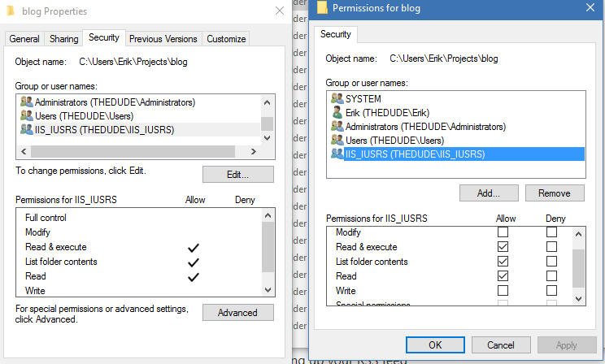

Next you'll need to solve the problem of the extension-less `/posts/name-of-my-post` file names that need to be served as if they contained an `index.html` when they don't.


Versus


In order to fix this Wyam has some [azure documentation](https://wyam.io/docs/deployment/azure) referencing the rewrite module in azure. IIS does not come with this pre-installed so you'll need to [install the module](https://www.iis.net/downloads/microsoft/url-rewrite) located at the bottom of the page.


Once that is complete you can drop in a `web.config` in your `input` directory with the rewrite rule referenced in the Wyam docs and voila! 

```xml
<?xml version="1.0"?>
<configuration>
  <system.webServer>
    <rewrite>
      <rules>
        <rule name="html">
          <match url="(.*)" />
          <conditions>
            <add input="{REQUEST_FILENAME}" matchType="IsFile" negate="true" />
            <add input="{REQUEST_FILENAME}" matchType="IsDirectory" negate="true" />
          </conditions>
          <action type="Rewrite" url="{R:1}.html" />
        </rule>
      </rules>
    </rewrite>
  </system.webServer>
</configuration>
```
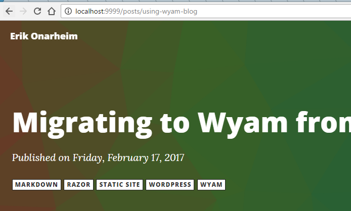

Now you can run `wyam -w` in your root blog directory and it will rebuilt the output when any input changes! The best part is this will be served by IIS that you've just stood up.

## Preserve you WordPress old links

If your blog has some good SEO juice, or maybe you just don't want to break older links, you'll want to preserve old links or at least redirect to your new ones. Here is how it is done

Wyam handles these via the Meta-refresh tag on specific pages using the `RedirectFrom` meta data like so

```markdown
Title: "Game Development – A Year in Review 2014"
Published: 1/9/2015
Tags:
- News
- Game Dev
- Excalibur
RedirectFrom: blog/game-development-a-year-in-review-2014/index.html

```

## Setting up automatic deployment with AppVeyor and GitHub Pages

AppVeyor is a super powerful CI/CD tool for Windows with free plans for open source. It's pretty much TravisCI for Windows. It's super easy to tie it to your GitHub account and add your repository for building.


Find your GH pages repo and turn it on.


I suggest only building on official pushes and not PR's because it is possible for anyone to craft a malicious PR to output secrets from appveyor. Also I recommend only building when `.appvyor.yml` files are present to prevent gratuituous error emails in your inbox before repo is ready for prime time.

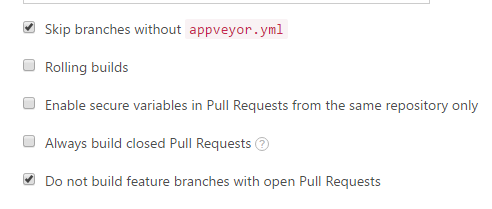

Wyam has a really nice `appveyor.yml` file [example](https://wyam.io/docs/deployment/appveyor) to follow. One caveat is that GitHub pages for user pages must be built from the master branch.

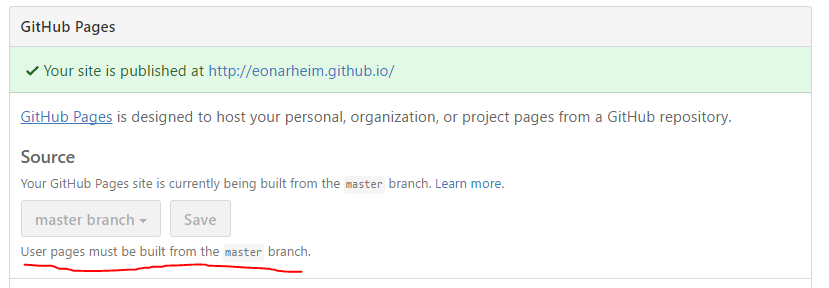

In order to accomodate this I had to tweak the provied yaml file a little. AppVeyer will only build on my source

```yml
branches:
  only:
    - source
    
install:
  - git submodule update --init --recursive
  - mkdir ..\Wyam
  - mkdir ..\output
  # Fetch the latest version of Wyam 
  - "curl -s https://raw.githubusercontent.com/Wyamio/Wyam/master/RELEASE -o ..\\Wyam\\wyamversion.txt"
  - set /P WYAMVERSION=< ..\Wyam\wyamversion.txt
  - echo %WYAMVERSION%
  # Get and unzip the latest version of Wyam
  - ps: Start-FileDownload "https://github.com/Wyamio/Wyam/releases/download/$env:WYAMVERSION/Wyam-$env:WYAMVERSION.zip" -FileName "..\Wyam\Wyam.zip"
  - 7z x ..\Wyam\Wyam.zip -o..\Wyam -r

build_script:
  - ..\Wyam\wyam --output ..\output

on_success:
  # Switch branches to gh-pages, clean the folder, copy everything in from the Wyam output, and commit/push
  # See http://www.appveyor.com/docs/how-to/git-push for more info
  - git config --global credential.helper store
  # EDIT your Git email and name
  - git config --global user.email $env:op_build_user_email
  - git config --global user.name AppVeyor
  - ps: Add-Content "$env:USERPROFILE\.git-credentials" "https://$($env:access_token):x-oauth-basic@github.com`n"
  - git checkout master
  - git rm -rf .
  - xcopy ..\output . /E
  # EDIT the origin of your repository - have to reset it here because AppVeyor pulls from SSH, but GitHub won't accept SSH pushes
  - git remote set-url origin https://github.com/eonarheim/eonarheim.github.io.git
  - git add -A
  - git commit -a -m "Commit from AppVeyor"
  - git push

```

Also you'll notice my `env:access_token` this is setup in AppVeyor's encrypted environment variables.


This can be generated by logging into GitHub, and generating a "Personal Access Token", with `repo` scope.


Now AppVeyor builds commits to my origin `source` branch automagically! And Voila!
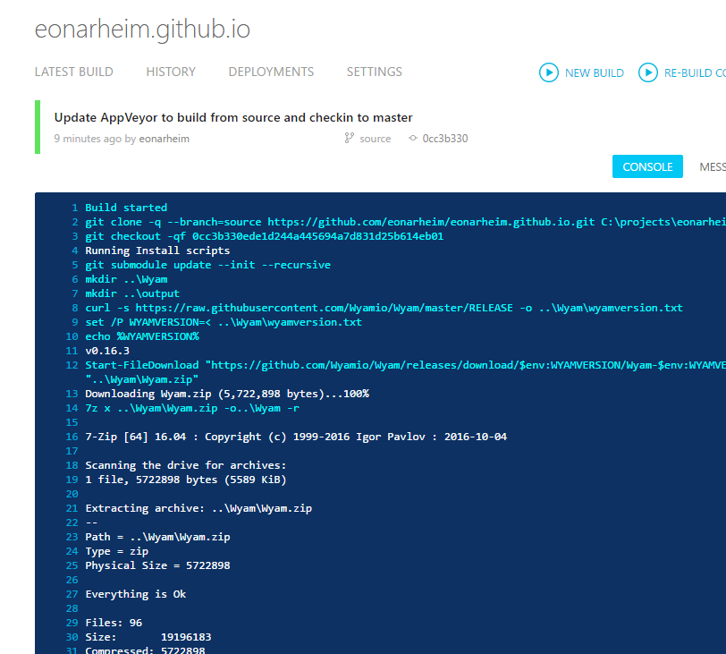

Finished product!

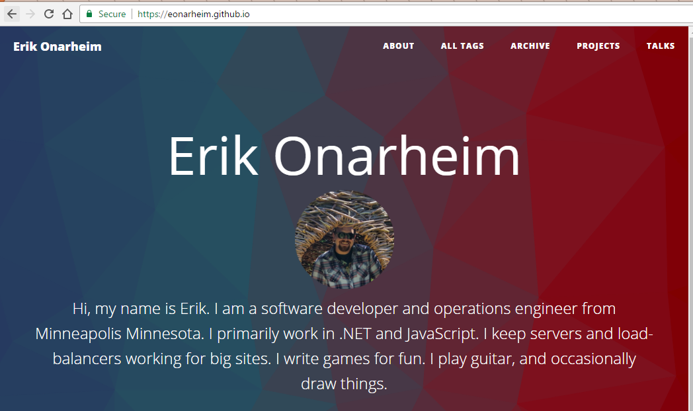

## Using CloudFlare CDN for HTTPS and Custom Domains

CloudFlare is super useful (and free) for setting up HTTPS for your GitHub pages, and for the free tier account it is very full featured. If you aren't too squeamish about surrendering your NS (name server) records, it is pretty simple.

1. Sign up for a free account on [cloudflare](https://www.cloudflare.com/)

2. CloudFlare can scan the DNS records in your site and let you know if there will be any problems migrating.

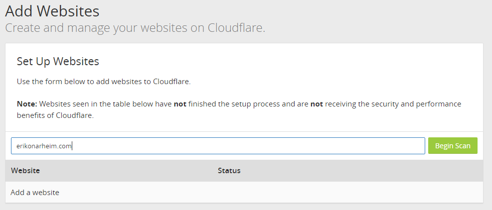

3. Update your name server records to point to CloudFlare's names servers so the can serve up DNS on your behalf. In my case, I use a service called DNSimple.com but you may use GoDaddy or NameCheap as your registrar.

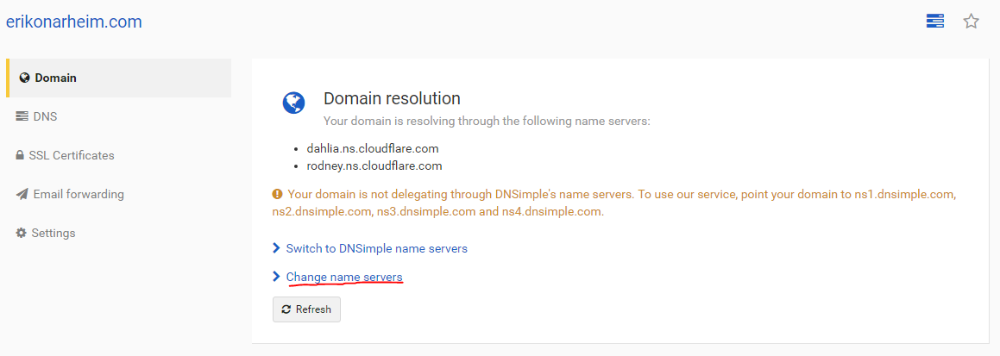

4. Setup your free SSL certificate by switching the SSL drop down to "full", **this can take some time so keep that in mind**. The CloudFlare site says up to 24 hours (but from experience it seems to finish in about an hour or so).


Once everything has been provisioned and propagated you'll notice that CloudFlare is serving your domain off of a SAN certificate.

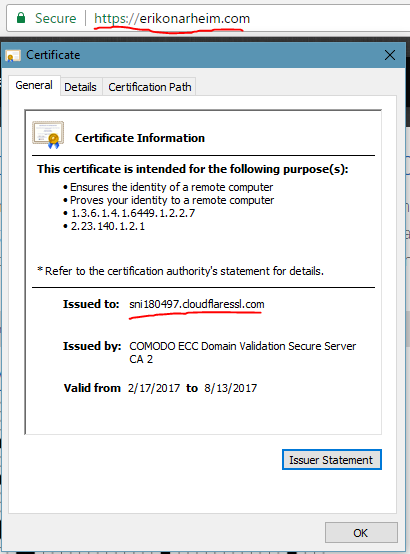


We are done! The new Wyam blog platform is now ready for new posts and is on a more sustainable and secure set of technologies. Hopefully you find this useful, let me know what you think.

-Erik

